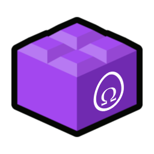
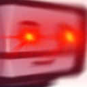
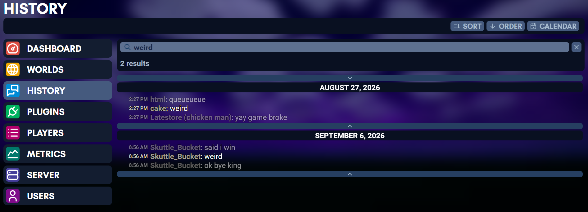
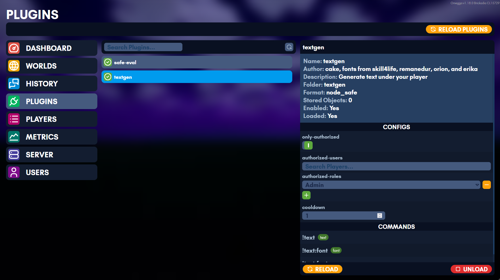
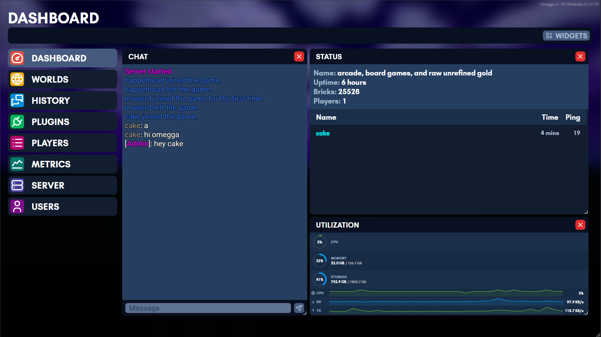
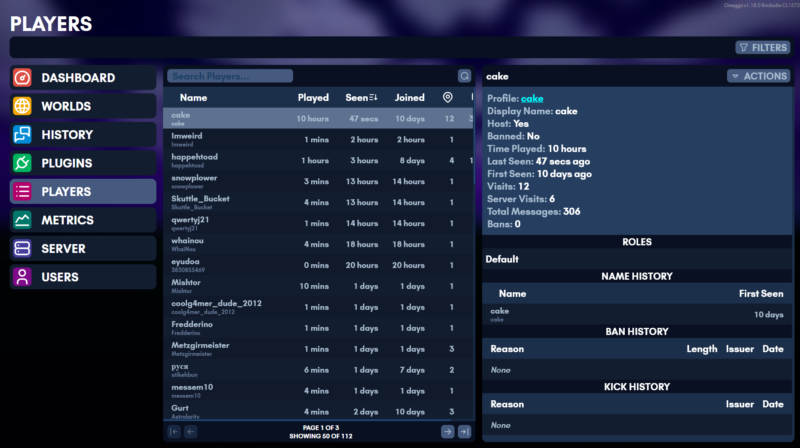
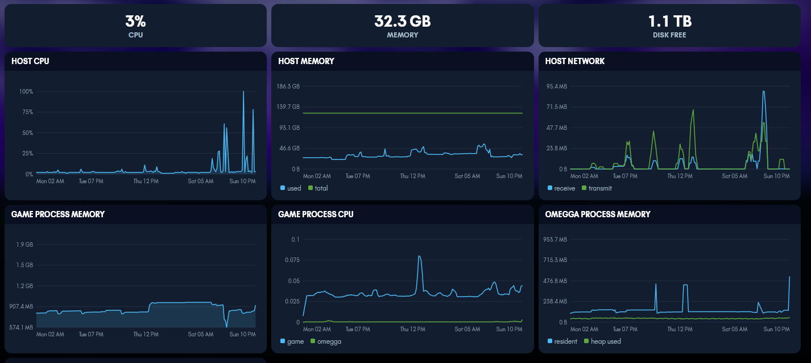
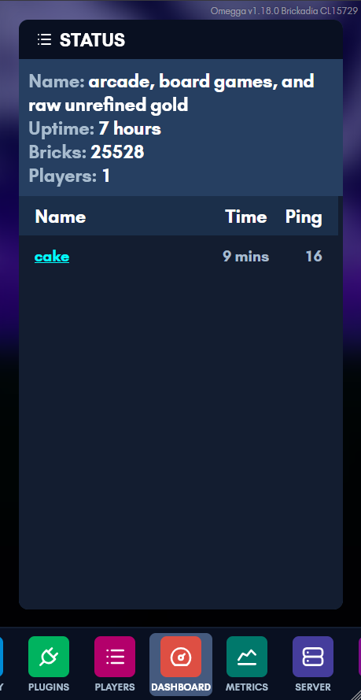

#   Omegga

Omegga wraps [Brickadia](https://brickadia.com/)'s server console to provide
interactivity and utility via plugins along with a web interface for managing
your server.

[Join the discord](https://discord.gg/UcdwTYhS75) to browse plugins and get
support.

<a href="assets/screenshots/console-home.png"></a>
<a href="assets/screenshots/chat-search.png"></a>
<a href="assets/screenshots/plugins.png"></a>
<a href="assets/screenshots/dashboard.png"></a>
<a href="assets/screenshots/players.png"></a>
<a href="assets/screenshots/metrics.png"></a>
<a href="assets/screenshots/mobile-dashboard.png"></a>

## Quick Install

Get Omegga on Debian, Ubuntu, Fedora, or Arch with:

```sh
curl -fsSL https://omegga.brickadia.dev/install.sh | bash
```

[Omegga `install.sh` Docs](install/linux.html#quick-setup) | [Omegga `install.sh` Source](https://github.com/brickadia-community/omegga/blob/master/tools/install.sh)


## Start here

| | |
| --- | --- |
| [Installing](install/) | linux, WSL, a container, or Pterodactyl/Pelican |
| [Running](running.md) | starting a server and keeping it updated |
| [Troubleshooting](troubleshooting.md) | when it does not start |
| [Configuration](config.md) | `omegga-config.yml`, field by field |
| [Plugins](plugins/) | installing them, and writing your own |
| [API](api/) | what a plugin can reach |
| [Guides](guides/) | wires, HTTPS, and running on another machine |

## What omegga can do

- Automatically update/restart your server
- Manage your worlds from a web interface and load a world on startup/restart
- Chat with players while not on the server
- Read chat history with timestamps
- See kick and ban history
- Configure plugins from a web interface
- Manage permissions and multi-user role based access to the above features on a web ui

## What plugins can do

- Interface with in-game wires and react to in-game wire events
- Add custom chat !commands and /commands
- Respond to and send chat messages
- Load bricks onto a player's template
- Load/Clear regions of bricks, entities
- Damage/heal players
- Give/remove weapons to players
- Change the environment
- Teleport players, detect player's positions
- Grant players roles
- Detect when a brick with an interact component is clicked
