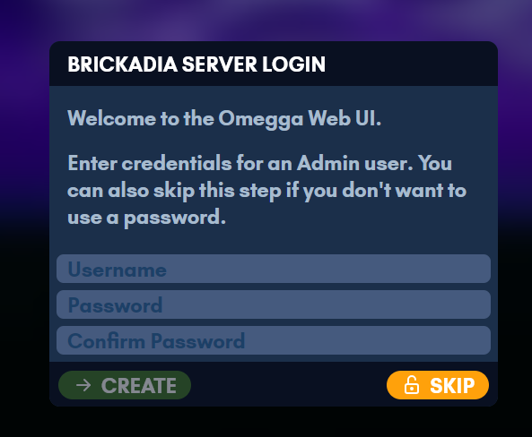
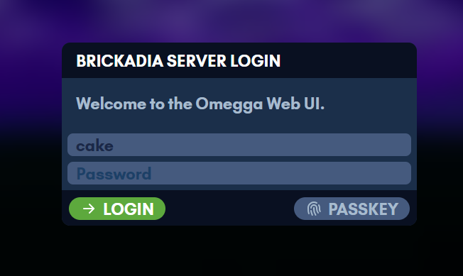

# Installing Omegga

Omegga runs on linux. Pick the one that matches where you are starting from:

| | |
| --- | --- |
| [Linux](linux.md) | a linux machine or VPS you already have a shell on |
| [Windows (WSL)](wsl.md) | Windows, through the Windows Subsystem for Linux |
| [Containers](../containers.md) | docker or podman, with node and omegga already in the image |
| [Pterodactyl / Pelican](../guides/pterodactyl.md) | a game server panel, running the published image from an egg |

Neither the container image nor the panel needs node on the host, since both run
the published image. Linux and WSL are the same install once you have a shell,
so the WSL page is just the extra steps to get one.

Get Omegga on Debian, Ubuntu, Fedora, or Arch with:

```sh
curl -fsSL https://omegga.brickadia.dev/install.sh | bash
```

This script will ask before installing anything, and refuses to install
omegga as root. [Read what it does](linux.md#quick-setup). Windows users need
[WSL](wsl.md) first: this script will not run on windows, and omegga
is not supported on Windows.

<font size="5" color="red">Do not install omegga or run brickadia/omegga as root/superuser</font>:

- running `whoami` should NOT print "root"
- your terminal prompt should NOT end with #
- you should NOT be typing `sudo npm i -g omegga`
- running `echo $EUID` should NOT print "0"
- if you type `pwd` it should NOT print "/root" (type `cd` to navigate to your user's home dir)

If any of the above are true, [create a new user](linux.md#creating-a-new-user)
and continue from there.

On first start omegga prints a one-time link to claim the web UI. You can set up
an admin account there, or skip it and run without a password.

<a href="../assets/screenshots/first-login.png"></a>
<a href="../assets/screenshots/web-login.png"></a>

Once it is installed, head to [Running](../running.md).
