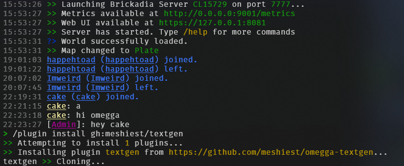
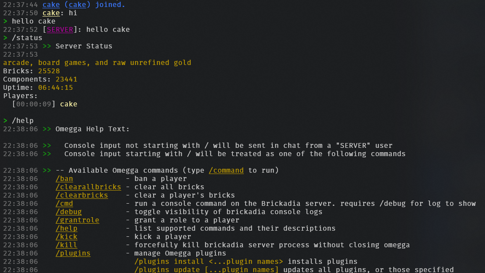
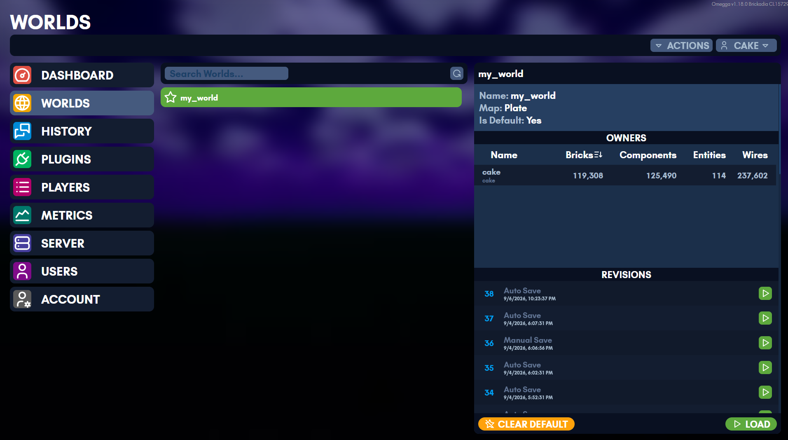
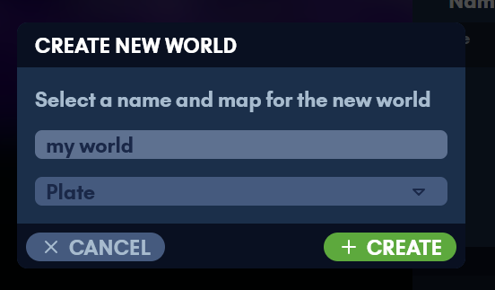
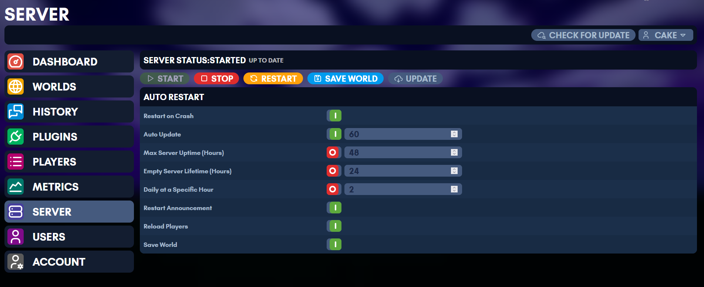

# Running

It's recommend to create a folder first _before_ starting your server:

```sh
# change "myServer" to "brickadia" or "server" or whatever you want
mkdir myServer && cd myServer

# this will place a folder called "myServer" in your home (cd ~)
```

To start a server, simply type the following in a linux shell after install:

    omegga

Omegga will prompt for credentials as necessary and only stores the auth tokens brickadia generates on login. **Omegga does not store your password**.

The first start downloads Brickadia through SteamCMD. Omegga uses a `steamcmd`
already on `PATH`, or asks before installing its own into
`~/.config/omegga/steam`. Installing one yourself first is optional. Anything
that cannot answer that prompt, like a service manager or a game panel, should
set `SKIP_STEAMCMD_PROMPT=true` to agree in advance.

Omegga runs in the current working directory. To have it always use the same
folder regardless of where you start it, run `omegga config default $(pwd)`.

Once it is up, the web UI is at <https://127.0.0.1:8080> unless you changed
`omegga.port`. See [Configuration](config.md) for what else the server reads on
startup.

<a href="assets/screenshots/console-startup.png"></a>

The console takes the same commands players type, plus omegga's own. `/help`
lists them, and plugins add their own to it.

<a href="assets/screenshots/console-home.png"></a>

## Worlds

Worlds are managed from the web UI: create one, load it, or set the one to load
on startup.

<a href="assets/screenshots/worlds.png"></a>
<a href="assets/screenshots/create-world.png"></a>

## Updating

There are two things to keep up to date, and they update differently: the
Brickadia server, and omegga itself.

### The Brickadia server

The Server page shows the installed game version and updates it, and omegga does
it on its own when automatic updates are on.

<a href="assets/screenshots/server.png"></a>

Without automatic updates, check for one by starting omegga with `--update`:

    omegga --update

The `/update` command in the omegga console does the same while it is running.

To install or update the game without starting the server, run `omegga
download`. It exits when SteamCMD finishes, which is what a provisioning step
wants, such as a game panel's install stage.

### Omegga itself

Omegga will tell you when it is out of date. It cannot replace itself while it
is running, so stop it first:

    npm i -g omegga

That is for the npm install. A container has omegga baked into the image and
updates by pulling a new one, covered in [Containers](containers.md); a game
panel updates by changing the image tag it runs, covered in
[Pterodactyl / Pelican](guides/pterodactyl.md).
